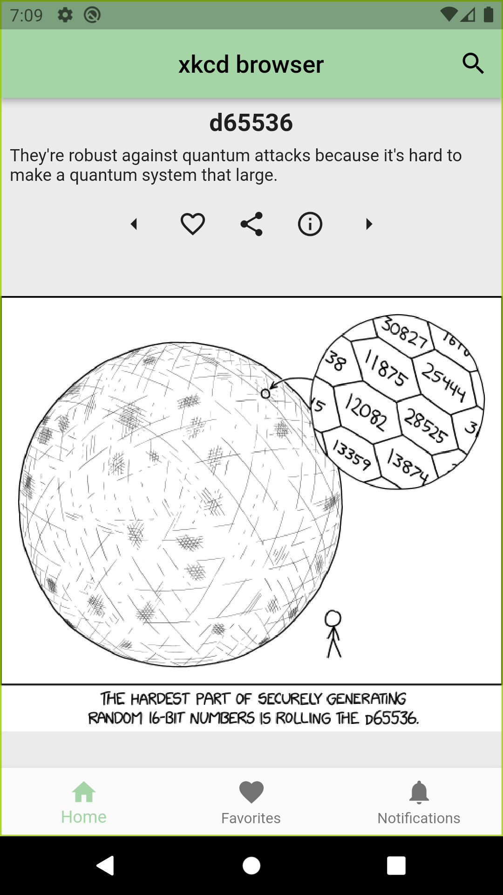
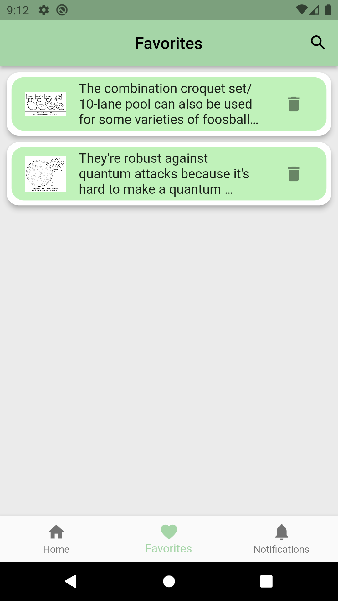
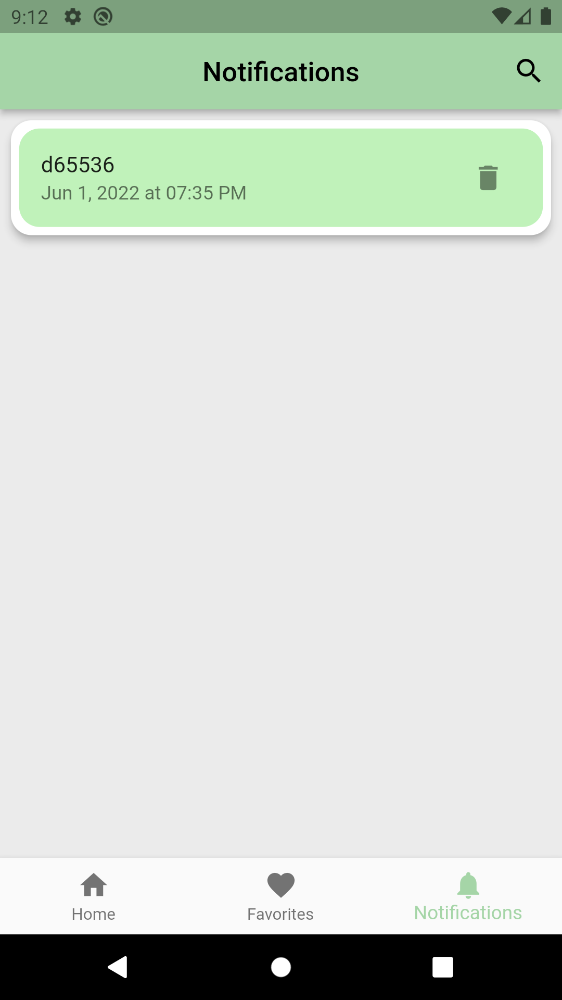
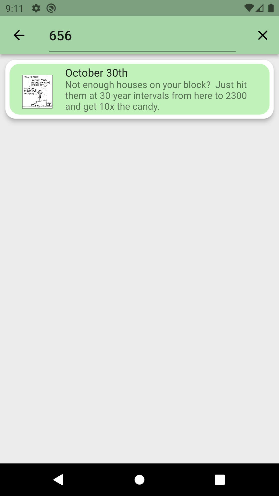

# xkcdbrowser

A Flutter application for [xkcd](https://xkcd.com/) comics.

## Features

- Browse the xkcd comics from the latest one to older ones
- Search comics by number
- Add your favorite comics to view them offline
- View more details and explanations for comics
- Share comics with your friends
- Get notifications for new comics

[ObjectBox](https://pub.dev/packages/objectbox) NoSQL database is used to store favorites. The following command should be run for the first time before running the project through IDE.

    flutter pub run build_runner build
